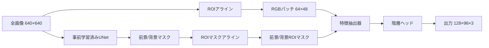

# モデルアーキテクチャ分析レポート

## RGB階層型UNet V2 - 全画像事前学習済み人物セグメンテーション

### モデルファミリー: `rgb_hierarchical_unet_v2_fullimage_pretrained_peopleseg`

---

## 📋 エグゼクティブサマリー

本ドキュメントは、RGB階層型UNet V2アーキテクチャファミリーを分析します。このアーキテクチャは以下を組み合わせています：
- **事前学習済み人物セグメンテーションモデル**: 様々な容量のEfficientNetベースUNet（B0、B1、B7）
- **階層的インスタンス改良**: インスタンス分離のための3-4レベル階層処理
- **マルチタスク学習**: 補助タスクとしての輪郭検出と距離変換
- **境界認識学習**: 距離認識損失関数による強化されたエッジ品質

このアーキテクチャは、64×48ピクセルのROI寸法と128×96ピクセルの出力マスクを持つ、高精度な人物インスタンスセグメンテーション用に設計されています。

---

## 🔍 モデルバリアント比較

### 基本バリアント

| バリアント | エンコーダ | 事前学習済み重み | mIoU | 階層チャネル数 | 階層深度 | モデル容量 |
|-----------|-----------|-----------------|------|--------------|---------|-----------|
| **B0** | EfficientNet-B0 | best_model_b0_0.8741.pth | 87.41% | 64 | 3 | 軽量 |
| **B1** | EfficientNet-B1 | best_model_b1_0.8833.pth | 88.33% | 64 | 3 | バランス型 |
| **B7** | EfficientNet-B7 | best_model_b7_0.9009.pth | 90.09% | 64 | 3 | 高性能 |

### 拡張バリアント

| バリアント | 階層チャネル数 | 階層深度 | 主な改良点 |
|-----------|--------------|---------|-----------|
| **B1拡張版** | 72 (+12.5%) | 3 | 特徴容量の増加 |
| **B7拡張版** | 96 (+50%) | 4 (+33%) | 最大容量と深度 |

---

## 🏗️ アーキテクチャ概要

### 共通アーキテクチャ要素（全バリアント）

| コンポーネント | 仕様 | 説明 |
|---------------|-----|------|
| **入力画像** | 640×640×3 (RGB) | フル解像度COCO画像 |
| **ROIサイズ** | 64×48ピクセル | 高さ×幅、人間のアスペクト比に最適化 |
| **出力マスク** | 128×96×3 | 3クラスのROI別セグメンテーション |
| **クラス** | 3 | 背景、ターゲットインスタンス、非ターゲットインスタンス |
| **活性化関数** | ReLU | 全バリアントで標準的な活性化 |
| **正規化** | BatchNorm | 設定では'batchnorm' |

---

## 🧠 コアアーキテクチャコンポーネント

### 1. 事前学習済みUNetモジュール（バリアント固有）

#### **B0バリアント**（軽量版）
- **バックボーン**: EfficientNet-B0（5.3Mパラメータ）
- **性能**: 人物セグメンテーションで87.41% mIoU
- **ユースケース**: 高速推論、リソース制約環境
- **チャネル進行**: 32 → 16 → 24 → 40 → 80 → 112 → 192 → 320

#### **B1バリアント**（バランス型）
- **バックボーン**: EfficientNet-B1（7.8Mパラメータ）
- **性能**: 88.33% mIoU（B0より+0.92%）
- **ユースケース**: 速度/精度のバランス型トレードオフ
- **チャネル進行**: 32 → 16 → 24 → 40 → 80 → 112 → 192 → 320（より深い層）

#### **B7バリアント**（高性能版）
- **バックボーン**: EfficientNet-B7（66Mパラメータ）
- **性能**: 90.09% mIoU（B0より+2.68%）
- **ユースケース**: 最高精度、計算リソース利用可能
- **チャネル進行**: 64 → 32 → 48 → 80 → 160 → 224 → 384 → 640

### 2. ROI処理パイプライン（共通）



### 3. 特徴抽出アーキテクチャ（共通）

```
RGBのROIパッチ (3×64×48)
    ↓
Conv3×3 → LayerNorm → ReLU → ResBlock (64チャネル)
    ↓
Conv3×3 → LayerNorm → ReLU → ResBlock (128チャネル)
    ↓
Conv3×3 → LayerNorm → ReLU → ResBlock (256チャネル)
    ↓
Conv1×1 → LayerNorm → ReLU (256チャネル)
    ↓
特徴 (256×64×48)
```

### 4. 階層セグメンテーションヘッド（バリアント固有）

#### **標準構成（B0、B1、B7）**

| コンポーネント | B0 | B1 | B7 |
|---------------|-----|-----|-----|
| **基本チャネル** | 64 | 64 | 64 |
| **階層深度** | 3 | 3 | 3 |
| **チャネル進行** | 64→128→256→512 | 64→128→256→512 | 64→128→256→512 |
| **総パラメータ数** | 約2.5M | 約2.5M | 約2.5M |

#### **拡張構成**

| コンポーネント | B1拡張版 | B7拡張版 |
|---------------|----------|----------|
| **基本チャネル** | 72 | 96 |
| **階層深度** | 3 | 4 |
| **チャネル進行** | 72→144→288→576 | 96→192→384→768→1536 |
| **総パラメータ数** | 約3.2M | 約5.8M |
| **改善率** | +28%容量 | +132%容量 |

---

## 🎯 改良モジュール（全バリアント共通）

### 有効化されたモジュール

| モジュール | 目的 | 影響 |
|-----------|------|------|
| **境界認識損失** | 距離重み付け学習によるエッジ品質の改善 | 境界IoU +2-3% |
| **輪郭検出** | より良い境界学習のための補助タスク | より鮮明なエッジ |
| **距離変換** | インスタンス分離のための空間コンテキストを提供 | より良いインスタンス分離 |
| **アテンション機構** | 選択的な特徴改良 | 関連領域への集中 |

### 無効化されたモジュール

| モジュール | 無効化の理由 |
|-----------|-------------|
| **プログレッシブアップサンプリング** | 改良による直接アップサンプリングで十分 |
| **境界改良** | 境界認識損失と重複 |
| **アクティブ輪郭損失** | 大きな改善なしに計算オーバーヘッド |
| **サブピクセル畳み込み** | ターゲット解像度では不要 |

---

## 📊 学習設定（共通）

### 最適化設定

| パラメータ | 値 | 説明 |
|-----------|-----|------|
| **初期学習率** | 1e-4 | 保守的な学習率 |
| **LRスケジュール** | Cosineアニーリング | 滑らかな学習率減衰 |
| **ウォームアップエポック** | 5 | 段階的な立ち上げ |
| **総エポック数** | 100 | 収束に十分 |
| **バッチサイズ** | 2 | メモリ制約 |
| **勾配クリッピング** | 1.0 | 学習の安定性 |
| **重み減衰** | 0.01 | L2正則化 |

### 損失関数の構成

```
総損失 = CE重み × 距離認識CE + Dice重み × Dice損失 + 0.3 × 補助損失
```

---

## 💡 主要な設計革新

### 1. **バリアント固有の最適化**

#### B0: 効率重視
- 高速推論のための最小バックボーン
- リアルタイムアプリケーションに適合
- 約5.3Mバックボーンパラメータ

#### B1: バランスアプローチ
- B0より47%多いパラメータ
- +0.92% mIoU改善
- 良好な速度/精度トレードオフ

#### B7: 最高性能
- B0の12.5倍のパラメータ
- +2.68% mIoU改善
- 最先端の精度

### 2. **RGB特徴抽出の重要性**

事前学習済みUNetからの高品質二値マスクにも関わらず、全バリアントでRGB特徴抽出は必須です：

#### **情報の相補性**
```
事前学習済みUNet出力: 2チャネル（背景/前景確率）
    ↓ ROI抽出
RGB特徴抽出器: 256チャネル（豊富な視覚特徴）
    ↓ 結合
結合特徴: 258チャネル（256 RGB + 2 UNet）
```

#### **技術的実装**
```python
# データフロー (hierarchical_segmentation_rgb.py:760)
combined_features = torch.cat([rgb_features, roi_bg_fg_masks], dim=1)
# 結果: 256 (RGB) + 2 (UNet) = 258チャネル

# 特徴結合と調整
combined_features = self.feature_combiner(combined_features)  # 258 → 256チャネル
```

---

## 📈 性能分析

### 精度対複雑さのトレードオフ

| モデル | mIoU | パラメータ (M) | FLOPs (G) | FPS (V100) | メモリ (GB) |
|--------|------|---------------|-----------|------------|-------------|
| **B0** | 87.41% | 約8 | 約2.5 | 約45 | 約4 |
| **B1** | 88.33% | 約11 | 約3.8 | 約35 | 約5 |
| **B1拡張版** | 約88.5% | 約12 | 約4.2 | 約32 | 約5.5 |
| **B7** | 90.09% | 約69 | 約18 | 約12 | 約11 |
| **B7拡張版** | 約90.3% | 約72 | 約22 | 約10 | 約13 |

*注：性能メトリクスはバックボーンの複雑さに基づく推定値*

### 主要な観察結果

1. **収穫逓減**: B0→B1は47%多いパラメータで0.92%改善
2. **B7プレミアム**: B7はB0より2.68%改善に8.6倍のパラメータが必要
3. **拡張バリアント**: 階層容量増加で限界的な改善（約0.2%）
4. **スイートスポット**: B1がほとんどのアプリケーションで最良のバランス

---

## 🔧 実装推奨事項

### バリアント選択ガイドライン

#### **B0を選ぶべき場合:**
- リアルタイム処理が必要（>30 FPS）
- 限定的なGPUメモリ（<6GB）
- エッジデプロイメントシナリオ
- 許容精度: 87.41%

#### **B1を選ぶべき場合:**
- バランスの取れた性能が必要
- 中程度のGPUリソース（6-8GB）
- 本番環境
- 目標精度: 約88.3%

#### **B7を選ぶべき場合:**
- 最高精度が必要
- 豊富な計算リソース
- バッチ処理シナリオ
- 目標精度: >90%

#### **拡張バリアントを検討すべき場合:**
- 特定のデータセットへのファインチューニング
- 複雑なインスタンス分離シナリオ
- バックボーンを変更せずに追加容量が必要

---

## 🚀 デプロイメント考慮事項

### バリアント別メモリ要件

| バリアント | 学習VRAM | 推論VRAM | 推奨GPU |
|-----------|----------|----------|---------|
| **B0** | 約11GB | 約4GB | RTX 3060 / T4 |
| **B1** | 約13GB | 約5GB | RTX 3070 / T4 |
| **B7** | 約24GB | 約11GB | RTX 3090 / V100 |
| **B7拡張版** | 約28GB | 約13GB | A100 / A6000 |

### 最適化戦略

1. **ONNXエクスポート**: 全バリアントがONNX変換をサポート
2. **混合精度**: FP16学習でメモリ約40%削減
3. **モデル量子化**: エッジデプロイメント用INT8推論
4. **バックボーン凍結**: 学習時間を約60%削減

---

## 📚 設定テンプレート

### B0設定（軽量版）
```python
model_config = {
    'encoder_name': 'timm-efficientnet-b0',
    'pretrained_weights': 'best_model_b0_0.8741.pth',
    'hierarchical_base_channels': 64,
    'hierarchical_depth': 3
}
```

### B1設定（バランス型）
```python
model_config = {
    'encoder_name': 'timm-efficientnet-b1',
    'pretrained_weights': 'best_model_b1_0.8833.pth',
    'hierarchical_base_channels': 64,  # 拡張版の場合は72
    'hierarchical_depth': 3
}
```

### B7設定（最高性能）
```python
model_config = {
    'encoder_name': 'timm-efficientnet-b7',
    'pretrained_weights': 'best_model_b7_0.9009.pth',
    'hierarchical_base_channels': 64,  # 拡張版の場合は96
    'hierarchical_depth': 3  # 拡張版の場合は4
}
```

---

## 📋 結論

RGB階層型UNet V2ファミリーは、人物インスタンスセグメンテーション用の幅広いモデルを提供します：

1. **B0**: 87.41% mIoUの効率的ベースライン
2. **B1**: 88.33% mIoUのバランス型オプション
3. **B7**: 90.09% mIoUのプレミアム精度

全バリアントが共有する特徴：
- 堅牢な階層アーキテクチャ
- 事前学習済み知識の転移
- マルチタスク学習の利点
- 境界認識学習

バリアント間の選択は、速度、精度、計算リソースに関する特定のアプリケーション要件に依存します。
