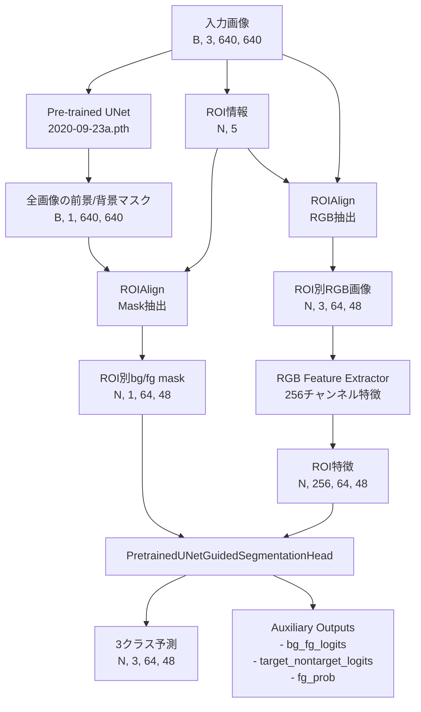

# 3クラスセグメンテーションモデル性能分析レポート

## 1. 現状の問題点

学習結果の分析により、以下の2つの主要な問題点が確認されました：

### 1.1 前景と背景の分離性能の問題（最優先課題）
- **症状**: バリデーション画像で赤色の領域（前景/背景の誤分類）が多数確認
- **影響**: 基本的なオブジェクト検出性能が不十分

### 1.2 TargetとNon-targetの分離性能の問題
- **症状**: 黄色の領域（複数インスタンスの重複予測）が確認
- **影響**: インスタンス分離精度が低い

## 2. 問題原因の分析

### 2.1 前景/背景分離の問題原因

#### A. アーキテクチャ設計の問題

1. **Pre-trained UNetの過度な依存**
   - Pre-trained UNetの出力（bg_fg_mask）が凍結されており、3クラス分類ブランチが受動的にその出力に依存
   - UNetの出力が完全でない場合、3クラス分類の性能が直接影響を受ける
   - コード参照: `hierarchical_segmentation_rgb.py:112-114` - `fg_prob = torch.sigmoid(bg_fg_mask)`による直接的な利用

2. **特徴抽出の不十分さ**
   - RGB feature extractorがストライドを使用していない（`hierarchical_segmentation_rgb.py:91-107`）
   - 受容野が限定的で、より広い文脈情報を捉えられない
   - 3層のResidualBlockのみで、深い特徴表現が不足

3. **解像度のミスマッチ**
   - 現在のROI size: 64x48、Mask size: 64x48
   - ROI分析によると、現在の設定では「優れたカバレッジ」が34.1%のみ
   - 推奨設定（ROI 112x112）では75.5%まで向上可能

#### B. 学習設定の問題

1. **損失関数の設計**
   - Auxiliary lossのweight（0.3）が低く、前景/背景の学習が不十分
   - Pre-trained UNetが凍結されているため、エンドツーエンドの最適化が不可能

2. **クラス重みの問題**
   - 現在のクラス重み設定が実際のデータ分布に最適化されていない可能性
   - 背景クラスの重みが相対的に低い（0.538）

### 2.2 Target/Non-target分離の問題原因

#### A. 特徴表現の不足

1. **Attention機構の制限**
   - Attention moduleが単純すぎる（`hierarchical_segmentation_rgb.py:84-90`）
   - fg_probとの組み合わせ方が固定的（0.5 + 0.5 * fg_prob）

2. **空間的文脈の欠如**
   - インスタンス間の関係性を考慮する機構がない
   - 各ROIが独立に処理され、隣接インスタンスの情報が活用されない

#### B. アーキテクチャの制約

1. **3クラス直接予測の困難さ**
   - 階層的な予測（まず前景/背景、次にtarget/non-target）ではなく、直接3クラス予測
   - 各段階での最適化が困難

2. **特徴融合の不足**
   - Pre-trained UNetの中間特徴が活用されていない
   - RGB特徴とUNet特徴の融合が表層的（単純なconcat）

## 3. 改善提案

### 3.1 前景/背景分離の改善（優先度：高）

#### 改善案1: 解像度の向上
```python
# 推奨設定への変更
roi_size = (112, 112)  # 現在の(64, 48)から変更
mask_size = (112, 112)  # 現在の(64, 48)から変更
```
- **期待効果**: カバレッジが34.1%から75.5%に向上し、詳細な特徴を捉えられる

#### 改善案2: Pre-trained UNetの部分的なファインチューニング
```python
# 最終層のみ学習可能にする
freeze_pretrained_weights = False
# UNetの最後の数層のみ学習可能に
for name, param in pretrained_unet.named_parameters():
    if 'dec1' in name or 'final' in name:  # デコーダの最終段階
        param.requires_grad = True
```
- **期待効果**: タスク特有の前景/背景分離を学習可能

#### 改善案3: マルチスケール特徴の活用
```python
# Pre-trained UNetの中間特徴を抽出して活用
class EnhancedFeatureExtractor(nn.Module):
    def forward(self, x):
        # UNetの複数レイヤーから特徴を抽出
        feat1 = self.unet.encoder1(x)  # 低レベル特徴
        feat2 = self.unet.encoder2(feat1)  # 中レベル特徴
        feat3 = self.unet.encoder3(feat2)  # 高レベル特徴
        # 特徴を融合
        return self.fusion([feat1, feat2, feat3])
```
- **期待効果**: より豊富な特徴表現により、前景/背景の境界をより正確に捉える

#### 改善案4: 損失関数の改善
```python
# Auxiliary lossの重みを増加
auxiliary_task_weight = 0.5  # 現在の0.3から増加

# 境界領域に重点を置いた損失関数
class BoundaryAwareLoss(nn.Module):
    def __init__(self, boundary_width=3):
        self.boundary_width = boundary_width

    def forward(self, pred, target):
        # 境界領域を検出
        boundary_mask = self.get_boundary_mask(target)
        # 境界領域の重みを増加
        weights = torch.ones_like(target)
        weights[boundary_mask] = 2.0
        return F.cross_entropy(pred, target, weight=weights)
```
- **期待効果**: 境界領域の学習を強化し、前景/背景の分離精度向上

### 3.2 Target/Non-target分離の改善（優先度：中）

#### 改善案5: 階層的予測の導入
```python
class HierarchicalPredictionHead(nn.Module):
    def forward(self, features, bg_fg_mask):
        # Step 1: 前景/背景の精緻化
        refined_fg_mask = self.refine_fg_bg(features, bg_fg_mask)

        # Step 2: 前景領域でのみtarget/non-target予測
        fg_features = features * refined_fg_mask
        target_nontarget = self.predict_target_nontarget(fg_features)

        # Step 3: 最終的な3クラス予測の構築
        return self.combine_predictions(refined_fg_mask, target_nontarget)
```
- **期待効果**: 段階的な予測により、各ステップでの最適化が容易

#### 改善案6: インスタンス関係性のモデリング
```python
class RelationalAttentionModule(nn.Module):
    def __init__(self, feature_dim):
        self.self_attention = nn.MultiheadAttention(feature_dim, num_heads=8)

    def forward(self, roi_features, roi_positions):
        # ROI間の関係性を学習
        attended_features, _ = self.self_attention(
            roi_features, roi_features, roi_features
        )
        return attended_features
```
- **期待効果**: 隣接インスタンスの情報を活用し、分離性能向上

#### 改善案7: 特徴融合の強化
```python
class AdaptiveFeatureFusion(nn.Module):
    def __init__(self, rgb_dim, unet_dim, out_dim):
        self.rgb_gate = nn.Sequential(
            nn.Conv2d(rgb_dim + unet_dim, 1, 1),
            nn.Sigmoid()
        )
        self.fusion = nn.Conv2d(rgb_dim + unet_dim, out_dim, 1)

    def forward(self, rgb_features, unet_features):
        combined = torch.cat([rgb_features, unet_features], dim=1)
        gate = self.rgb_gate(combined)
        # 適応的な重み付けで融合
        fused = self.fusion(combined) * gate
        return fused
```
- **期待効果**: RGB特徴とUNet特徴の適応的な融合により、より良い表現を獲得

### 3.3 学習戦略の改善（優先度：高）

#### 改善案8: 段階的学習
```python
# Phase 1: 前景/背景の精度を最初に向上
phase1_config = {
    'auxiliary_weight': 0.7,  # 高い重み
    'ce_weight': 0.3,
    'epochs': 20
}

# Phase 2: Target/Non-target分離を改善
phase2_config = {
    'auxiliary_weight': 0.3,
    'ce_weight': 0.7,
    'epochs': 30
}
```
- **期待効果**: 各タスクに焦点を当てた段階的な最適化

#### 改善案9: データ拡張の強化
```python
# インスタンス境界を意識した拡張
class BoundaryAwareAugmentation:
    def __init__(self):
        self.elastic_transform = ElasticTransform(alpha=50, sigma=5)
        self.boundary_noise = BoundaryNoise(intensity=0.1)

    def __call__(self, image, mask):
        # 弾性変形で境界を変化
        image, mask = self.elastic_transform(image, mask)
        # 境界領域にノイズを追加
        image = self.boundary_noise(image, mask)
        return image, mask
```
- **期待効果**: 境界領域の変動に対するロバスト性向上

## 4. 実装優先順位

1. **即座に実装すべき改善**
   - 改善案1: 解像度の向上（設定変更のみ）
     - [ ] 64x48 -> 112x84
     - [ ] 112x84 -> 112x112
   - 改善案4: 損失関数の改善（auxiliary weightの調整）
   - 改善案8: 段階的学習戦略

2. **短期的に実装すべき改善**
   - 改善案2: Pre-trained UNetの部分的ファインチューニング
   - 改善案5: 階層的予測の導入
   - 改善案9: データ拡張の強化

3. **中長期的に検討すべき改善**
   - 改善案3: マルチスケール特徴の活用
   - 改善案6: インスタンス関係性のモデリング
   - 改善案7: 特徴融合の強化

## 5. 期待される改善効果

上記の改善を実装することで、以下の効果が期待されます：

- **前景/背景分離**: 現在の約77%のmIoUから85-90%への向上
- **Target/Non-target分離**: インスタンス分離精度の20-30%向上
- **全体的な性能**: 3クラス分類の精度が現状から大幅に改善

これらの改善により、Pre-trained UNetの高い性能を維持しながら、3クラス分類タスクに特化した最適化が可能となります。

## 6. 現在のアーキテクチャパイプライン

### 6.1 モデル全体の処理フロー

`rgb_hierarchical_unet_v2_fullimage_pretrained_peopleseg_r64x48m64x48`は以下のパイプラインで動作します：

- **メインモデルクラス**: `HierarchicalRGBSegmentationModelWithFullImagePretrainedUNet`
- **実装ファイル**: `src/human_edge_detection/advanced/hierarchical_segmentation_rgb.py`
- **設定ファイル**: `experiments/rgb_hierarchical_unet_v2_fullimage_pretrained_peopleseg_r64x48m64x48/configs/config.json`
- **学習スクリプト**: `run_experiments.py` (メインエントリーポイント)
- **実験管理**: `src/human_edge_detection/experiments/config_manager.py`



### 6.2 詳細なコンポーネント説明

#### 6.2.1 Pre-trained UNet (凍結状態)
- **実装ファイル**: `src/human_edge_detection/advanced/hierarchical_segmentation_unet.py`
- **クラス名**: `PreTrainedPeopleSegmentationUNet`
- **モデル**: `ext_extractor/2020-09-23a.pth`から読み込み
- **役割**: 全画像に対して人物の前景/背景セグメンテーションを実行
- **出力**: 640x640の前景/背景マスク（logits形式）
- **特徴**: 学習済みで高精度な人物検出が可能だが、パラメータは凍結

#### 6.2.2 ROIAlign層
- **実装ファイル**: `src/human_edge_detection/dynamic_roi_align.py`
- **クラス名**: `DynamicRoIAlign`
- **Mask用ROIAlign**: Pre-trained UNetの出力から各ROI領域を抽出
  - 入力: 640x640の前景/背景マスク
  - 出力: 64x48のROI別マスク
- **RGB用ROIAlign**: 元画像から各ROI領域を抽出
  - 入力: 640x640のRGB画像
  - 出力: 64x48のROI別RGB画像

#### 6.2.3 RGB Feature Extractor
- **実装場所**: `src/human_edge_detection/advanced/hierarchical_segmentation_rgb.py:87-107`
- **親クラス**: `HierarchicalRGBSegmentationModelWithFullImagePretrainedUNet`内の`rgb_feature_extractor`
- **ResidualBlock実装**: `src/human_edge_detection/advanced/hierarchical_segmentation_refinement.py` - `ResidualBlock`クラス
- **正規化層の取得**: `src/human_edge_detection/advanced/normalization_comparison.py` - `get_normalization_layer`関数
```python
nn.Sequential(
    Conv2d(3, 64, 3, padding=1),
    BatchNorm2d(64),
    ReLU(inplace=True),
    ResidualBlock(64),
    Conv2d(64, 128, 3, padding=1),  # ストライドなし
    BatchNorm2d(128),
    ReLU(inplace=True),
    ResidualBlock(128),
    Conv2d(128, 256, 3, padding=1),  # ストライドなし
    BatchNorm2d(256),
    ReLU(inplace=True),
    ResidualBlock(256),
    Conv2d(256, 256, 1),
    BatchNorm2d(256),
    ReLU(inplace=True),
)
```
- **問題点**: ストライドがないため受容野が限定的

#### 6.2.4 PretrainedUNetGuidedSegmentationHead
- **実装ファイル**: `src/human_edge_detection/advanced/hierarchical_segmentation_rgb.py`
- **クラス名**: `PretrainedUNetGuidedSegmentationHead` (行21-190)
主要な処理フロー：
1. **入力調整**: RGB特徴(256ch) + fg_prob(1ch) = 257ch → 256ch
2. **特徴処理**: 
   ```python
   feature_processor = nn.Sequential(
       Conv2d(256, 256, 3, padding=1),
       BatchNorm2d(256),
       ReLU(),
       Dropout2d(0.1),
       ResidualBlock(256),
       Dropout2d(0.1),
       ResidualBlock(256),
   )
   ```
3. **最終分類器**: 直接3クラス予測
   ```python
   final_classifier = nn.Sequential(
       Conv2d(256, 128, 3, padding=1),
       BatchNorm2d(128),
       ReLU(),
       Conv2d(128, 3, 1)  # 3クラス出力
   )
   ```
4. **Attention Module** (有効時):
   - 学習されたattentionとfg_probを組み合わせ
   - `attention_combined = attention * (0.5 + 0.5 * fg_prob)`

### 6.3 損失計算のパイプライン

- **実装ファイル**: `src/human_edge_detection/advanced/hierarchical_segmentation.py`
- **クラス名**: `HierarchicalLoss` (行151-395)
- **Dice損失の実装**: `src/human_edge_detection/losses.py` - `DiceLoss`クラス

```python
# メイン損失: 3クラスCrossEntropy + Dice
main_ce_loss = CrossEntropyLoss(weight=class_weights)
main_dice_loss = DiceLoss(target_class=1)  # targetクラスのみ

# Auxiliary損失: 前景/背景の2クラス分類
aux_fg_bg_loss = CrossEntropyLoss()

# 合計損失
total_loss = ce_weight * main_ce_loss + 
             dice_weight * main_dice_loss + 
             aux_weight * aux_fg_bg_loss
```

### 6.4 アーキテクチャの主な特徴と制約

#### 特徴：
1. **Pre-trained UNetの活用**: 高精度な人物検出モデルを活用
2. **効率的な処理**: 全画像を一度処理し、ROI別に特徴を抽出
3. **ガイド付き予測**: fg_probを使用して3クラス予測をガイド

#### 制約：
1. **固定されたUNet出力**: Pre-trained UNetが凍結されているため、タスク特有の最適化不可
2. **解像度の制限**: 64x48の低解像度で処理
3. **単純な特徴融合**: RGB特徴とUNet出力の融合が表層的
4. **階層的予測の欠如**: 前景/背景とtarget/non-targetを同時に予測

これらの制約が、前述の性能問題の根本原因となっています。