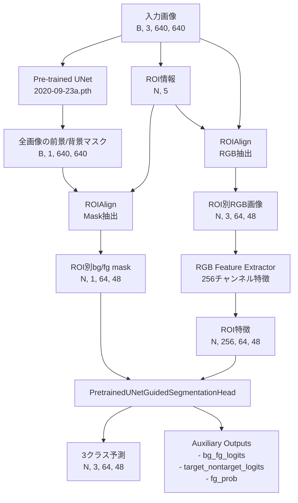

# 3クラスセグメンテーションモデル性能分析レポート

## 1. 現状の問題点

学習結果の分析により、以下の2つの主要な問題点が確認されました：

### 1.1 前景と背景の分離性能の問題（最優先課題）
- **症状**: バリデーション画像で赤色の領域（前景/背景の誤分類）が多数確認
- **影響**: 基本的なオブジェクト検出性能が不十分

### 1.2 TargetとNon-targetの分離性能の問題
- **症状**: 黄色の領域（複数インスタンスの重複予測）が確認
- **影響**: インスタンス分離精度が低い

## 2. 問題原因の分析

### 2.1 前景/背景分離の問題原因

#### A. アーキテクチャ設計の問題

1. **Pre-trained UNetの過度な依存**
   - Pre-trained UNetの出力（bg_fg_mask）が凍結されており、3クラス分類ブランチが受動的にその出力に依存
   - UNetの出力が完全でない場合、3クラス分類の性能が直接影響を受ける
   - コード参照: `hierarchical_segmentation_rgb.py:112-114` - `fg_prob = torch.sigmoid(bg_fg_mask)`による直接的な利用

2. **特徴抽出の不十分さ**
   - RGB feature extractorがストライドを使用していない（`hierarchical_segmentation_rgb.py:91-107`）
   - 受容野が限定的で、より広い文脈情報を捉えられない
   - 3層のResidualBlockのみで、深い特徴表現が不足

3. **解像度のミスマッチ**
   - 現在のROI size: 64x48、Mask size: 64x48
   - ROI分析によると、現在の設定では「優れたカバレッジ」が34.1%のみ
   - 推奨設定（ROI 112x112）では75.5%まで向上可能

#### B. 学習設定の問題

1. **損失関数の設計**
   - Auxiliary lossのweight（0.3）が低く、前景/背景の学習が不十分
   - Pre-trained UNetが凍結されているため、エンドツーエンドの最適化が不可能

2. **クラス重みの問題**
   - 現在のクラス重み設定が実際のデータ分布に最適化されていない可能性
   - 背景クラスの重みが相対的に低い（0.538）

### 2.2 Target/Non-target分離の問題原因

#### A. 特徴表現の不足

1. **Attention機構の制限**
   - Attention moduleが単純すぎる（`hierarchical_segmentation_rgb.py:84-90`）
   - fg_probとの組み合わせ方が固定的（0.5 + 0.5 * fg_prob）

2. **空間的文脈の欠如**
   - インスタンス間の関係性を考慮する機構がない
   - 各ROIが独立に処理され、隣接インスタンスの情報が活用されない

#### B. アーキテクチャの制約

1. **3クラス直接予測の困難さ**
   - 階層的な予測（まず前景/背景、次にtarget/non-target）ではなく、直接3クラス予測
   - 各段階での最適化が困難

2. **特徴融合の不足**
   - Pre-trained UNetの中間特徴が活用されていない
   - RGB特徴とUNet特徴の融合が表層的（単純なconcat）

## 3. 改善提案

### 3.1 前景/背景分離の改善（優先度：高）

#### 改善案1: 解像度の向上【設定変更のみで実装可能】
```json
// config.jsonでの変更
"model": {
    "roi_size": [112, 84],    // 段階的に変更（現在: [64, 48]）
    "mask_size": [112, 84]    // または直接 [112, 112] へ
}
```
- **実装方法**: `experiments/*/configs/config.json`を編集するだけ
- **期待効果**: カバレッジが34.1%から75.5%に向上し、詳細な特徴を捉えられる

#### 改善案2: Pre-trained UNetのファインチューニング【設定変更のみで実装可能】
```json
// config.jsonでの変更
"model": {
    "freeze_pretrained_weights": false  // 現在: true
}
```
- **実装方法**: 既に`PreTrainedPeopleSegmentationUNet`にfreeze_weightsパラメータが実装済み
- **追加実装案**: 部分的なファインチューニング（最終層のみ）を行う場合
```python
# run_experiments.py または学習スクリプトで実装
def selective_unfreeze(model, layers_to_unfreeze):
    for name, param in model.pretrained_unet.named_parameters():
        if any(layer in name for layer in layers_to_unfreeze):
            param.requires_grad = True
```
- **期待効果**: タスク特有の前景/背景分離を学習可能

#### 改善案3: マルチスケール特徴の活用【新規実装が必要】
- **現状**: Pre-trained UNetは最終出力のみを使用
- **実装案**: UNetの中間特徴を抽出する仕組みを追加
```python
# hierarchical_segmentation_unet.pyに追加実装
class PreTrainedUNetWithIntermediateFeatures(PreTrainedPeopleSegmentationUNet):
    def forward(self, x):
        # 既存のforward処理に加えて中間特徴を返す
        features = []
        # encoder段階での特徴を保存
        x = self.model.encoder.conv_stem(x)
        features.append(x)  # 低レベル特徴
        # ... 各段階での特徴を収集
        return output, features
```
- **期待効果**: より豊富な特徴表現により、前景/背景の境界をより正確に捉える

#### 改善案4: 損失関数の改善【一部は設定変更で可能】
```json
// config.jsonでの変更
"auxiliary_task": {
    "weight": 0.5    // 現在: 0.3
}
```
- **実装方法**: Auxiliary lossの重みは設定で変更可能
- **追加実装案**: 境界認識損失の実装
```python
# distance_aware_loss.pyを活用または新規実装
from .distance_aware_loss import DistanceAwareLoss

# config.jsonで有効化
"distance_loss": {
    "enabled": true,
    "boundary_width": 5,
    "boundary_weight": 2.0
}
```
- **期待効果**: 境界領域の学習を強化し、前景/背景の分離精度向上

### 3.2 Target/Non-target分離の改善（優先度：中）

#### 改善案5: 階層的予測の強化【現在の実装を改良】
- **現状**: `PretrainedUNetGuidedSegmentationHead`で直接3クラス予測
- **改善案**: 既存の階層的構造（`HierarchicalLoss`）をより活用
```python
# PretrainedUNetGuidedSegmentationHeadの改良
class ImprovedHierarchicalHead(PretrainedUNetGuidedSegmentationHead):
    def forward(self, features, bg_fg_mask):
        # 既存の処理に加えて、段階的な予測を強化
        fg_prob = torch.sigmoid(bg_fg_mask)

        # Step 1: 前景領域の精緻化（現在は単純なsigmoid）
        refined_fg_prob = self.refine_fg_mask(features, fg_prob)

        # Step 2: マスクされた特徴での予測
        masked_features = features * refined_fg_prob

        # 既存の処理を継続...
```
- **期待効果**: 段階的な予測により、各ステップでの最適化が容易

#### 改善案6: Attention機構の改良【既存実装の拡張】
- **現状**: 単純なAttention module（`attention * (0.5 + 0.5 * fg_prob)`）
- **改善案**: より洗練されたAttention機構
```python
# hierarchical_segmentation_rgb.pyの改良
"use_attention_module": true,  # 既に有効

# attention_modules.pyを活用して改良
from .attention_modules import SpatialAttentionModule, ChannelAttentionModule

class ImprovedAttention(nn.Module):
    def __init__(self, channels):
        super().__init__()
        self.spatial_att = SpatialAttentionModule()
        self.channel_att = ChannelAttentionModule(channels)

    def forward(self, features, fg_prob):
        # 空間的・チャンネル的な注意機構を組み合わせ
        spatial_weight = self.spatial_att(features)
        channel_weight = self.channel_att(features)
        return features * spatial_weight * channel_weight * fg_prob
```
- **期待効果**: より精密な特徴の重み付けによる分離性能向上

#### 改善案7: 特徴融合の改善【現在の単純な結合を改良】
- **現状**: RGB特徴とbg_fg_maskの単純なconcat
- **改善案**: 既存のコードを拡張
```python
# 現在のinput_adjust (257ch → 256ch)を改良
class AdaptiveFeatureFusion(nn.Module):
    def __init__(self, rgb_channels, mask_channels=1):
        super().__init__()
        total_channels = rgb_channels + mask_channels

        # ゲート機構を追加
        self.gate = nn.Sequential(
            nn.Conv2d(total_channels, rgb_channels // 4, 1),
            nn.ReLU(),
            nn.Conv2d(rgb_channels // 4, rgb_channels, 1),
            nn.Sigmoid()
        )

        self.fusion = nn.Conv2d(total_channels, rgb_channels, 1)

    def forward(self, rgb_features, mask):
        combined = torch.cat([rgb_features, mask], dim=1)
        gate_weights = self.gate(combined)
        fused = self.fusion(combined)
        return fused * gate_weights + rgb_features * (1 - gate_weights)
```
- **期待効果**: 適応的な特徴融合により、タスクに応じた最適な表現を獲得

### 3.3 学習戦略の改善（優先度：高）

#### 改善案8: 段階的学習【config.jsonの調整とスクリプトの活用】
- **現状**: 固定の重み設定で学習
- **改善案**: 段階的な重み調整
```python
# run_experiments.pyに段階的学習を実装
def phased_training(config_name, phases):
    for phase_num, phase_config in enumerate(phases):
        # config.jsonを一時的に更新
        update_config(config_name, {
            "auxiliary_task": {"weight": phase_config["aux_weight"]},
            "training": {
                "ce_weight": phase_config["ce_weight"],
                "dice_weight": phase_config["dice_weight"],
                "num_epochs": phase_config["epochs"]
            }
        })

        # 学習実行
        run_experiment(config_name, resume=phase_num > 0)

# 使用例
phases = [
    {"aux_weight": 0.7, "ce_weight": 0.3, "dice_weight": 0.0, "epochs": 20},  # Phase 1
    {"aux_weight": 0.3, "ce_weight": 0.7, "dice_weight": 1.0, "epochs": 30}   # Phase 2
]
```
- **期待効果**: 各タスクに焦点を当てた段階的な最適化

#### 改善案9: データ拡張の改善【既存設定の活用と拡張】
- **現状**: `use_augmentation: true`, `augmentation_prob: 0.5`が設定済み
- **改善案**: データセットレベルでの拡張強化
```python
# dataset_adapter.pyまたは新規実装
from torchvision import transforms
import albumentations as A

class EnhancedAugmentation:
    def __init__(self, augmentation_prob=0.5):
        self.transform = A.Compose([
            A.HorizontalFlip(p=0.5),
            A.RandomBrightnessContrast(p=0.3),
            A.RandomGamma(p=0.3),
            # 境界を意識した拡張
            A.ElasticTransform(alpha=50, sigma=5, p=0.3),
            A.GridDistortion(p=0.3),
            # ROI内での変形
            A.ShiftScaleRotate(shift_limit=0.1, scale_limit=0.1, rotate_limit=15, p=0.5)
        ], bbox_params=A.BboxParams(format='coco', label_fields=['category_ids']))

    def __call__(self, image, bboxes, masks):
        # 拡張を適用
        transformed = self.transform(image=image, bboxes=bboxes, masks=masks)
        return transformed['image'], transformed['bboxes'], transformed['masks']
```
- **実装方法**: データローダーでの拡張処理を強化
- **期待効果**: より多様な入力に対するロバスト性向上

## 4. 実装優先順位と推奨戦略

### 4.1 即座に実装可能（設定変更のみ）
1. **改善案1: 解像度の向上**
   ```bash
   # Step 1: 段階的な解像度向上
   # config.jsonを編集: roi_size: [64, 48] → [112, 84] → [112, 112]
   ```

2. **改善案2: Pre-trained UNetのファインチューニング**
   ```bash
   # config.jsonを編集: freeze_pretrained_weights: true → false
   ```

3. **改善案4: Auxiliary loss重みの調整**
   ```bash
   # config.jsonを編集: auxiliary_task.weight: 0.3 → 0.5
   ```

### 4.2 短期的に実装（軽微なコード変更）
1. **改善案8: 段階的学習の実装**
   - run_experiments.pyに段階的な設定変更機能を追加
   - 既存のresume機能を活用

2. **改善案6: Attention機構の改良**
   - 既存のattention_modules.pyを活用
   - PretrainedUNetGuidedSegmentationHeadの改良

3. **改善案9: データ拡張の強化**
   - dataset_adapter.pyでの拡張処理追加
   - albumentationsライブラリの活用

### 4.3 中期的に実装（新規実装が必要）
1. **改善案3: マルチスケール特徴の活用**
   - Pre-trained UNetの中間特徴抽出機能の追加
   - 特徴融合メカニズムの実装

2. **改善案5: 階層的予測の強化**
   - 段階的な予測構造の実装
   - 各段階での最適化

3. **改善案7: 特徴融合の高度化**
   - ゲート機構を持つ融合モジュールの実装
   - 適応的な重み付け

### 4.4 推奨実行順序
```bash
# Phase 1: 即座に効果が期待できる改善（1週間）
1. 解像度を112x84に変更して学習
2. auxiliary_task.weightを0.5に変更
3. freeze_pretrained_weightsをfalseに変更
4. 20エポック学習して効果を確認

# Phase 2: 短期改善の実装（2週間）
1. 段階的学習スクリプトの実装
2. データ拡張の強化
3. Attention機構の改良
4. 追加30エポック学習

# Phase 3: 中期改善の実装（1ヶ月）
1. マルチスケール特徴抽出の実装
2. 高度な特徴融合の実装
3. 全体的な最適化
```

## 5. 期待される改善効果

### 5.1 Phase 1実装後の期待効果（設定変更のみ）
- [x] **解像度向上（64x48→112x84）**:
  - ROIカバレッジ: 34.1% → 約55-60%
  - 細部の特徴捕捉能力の向上
- **UNetファインチューニング**:
  - タスク特有の前景/背景分離の学習
  - mIoU: 77.5% → 80-82%（推定）
- **Auxiliary loss重み増加**:
  - 前景/背景分離の精度向上
  - 赤色領域（誤分類）の削減

### 5.2 Phase 2実装後の期待効果（短期改善）
- **段階的学習**:
  - 各タスクでの最適化による性能向上
  - 学習の安定性向上
- **データ拡張強化**:
  - 汎化性能の向上
  - エッジケースへの対応力向上
- **Attention改良**:
  - Target/Non-target分離精度: +10-15%
  - 黄色領域（重複予測）の削減

### 5.3 Phase 3実装後の期待効果（中期改善）
- **マルチスケール特徴**:
  - 境界領域の精度向上
  - mIoU: 82% → 85-88%（推定）
- **高度な特徴融合**:
  - 3クラス分類の全体的な精度向上
  - インスタンス分離精度: +20-25%

### 5.4 最終的な目標性能
- **前景/背景分離**: mIoU 85-90%
- **Target/Non-target分離**: インスタンス分離精度 90%以上
- **3クラス分類精度**: 現状から30-40%の改善

これらの改善により、Pre-trained UNetの高い性能を活かしつつ、3クラス分類タスクに最適化されたモデルが実現可能となります。

## 6. 現在のアーキテクチャパイプライン

### 6.1 モデル全体の処理フロー

`rgb_hierarchical_unet_v2_fullimage_pretrained_peopleseg_r64x48m64x48`は以下のパイプラインで動作します：

- **メインモデルクラス**: `HierarchicalRGBSegmentationModelWithFullImagePretrainedUNet`
- **実装ファイル**: `src/human_edge_detection/advanced/hierarchical_segmentation_rgb.py`
- **設定ファイル**: `experiments/rgb_hierarchical_unet_v2_fullimage_pretrained_peopleseg_r64x48m64x48/configs/config.json`
- **学習スクリプト**: `run_experiments.py` (メインエントリーポイント)
- **実験管理**: `src/human_edge_detection/experiments/config_manager.py`



### 6.2 詳細なコンポーネント説明

#### 6.2.1 Pre-trained UNet (凍結状態)
- **実装ファイル**: `src/human_edge_detection/advanced/hierarchical_segmentation_unet.py`
- **クラス名**: `PreTrainedPeopleSegmentationUNet`
- **モデル**: `ext_extractor/2020-09-23a.pth`から読み込み
- **役割**: 全画像に対して人物の前景/背景セグメンテーションを実行
- **出力**: 640x640の前景/背景マスク（logits形式）
- **特徴**: 学習済みで高精度な人物検出が可能だが、パラメータは凍結

#### 6.2.2 ROIAlign層
- **実装ファイル**: `src/human_edge_detection/dynamic_roi_align.py`
- **クラス名**: `DynamicRoIAlign`
- **Mask用ROIAlign**: Pre-trained UNetの出力から各ROI領域を抽出
  - 入力: 640x640の前景/背景マスク
  - 出力: 64x48のROI別マスク
- **RGB用ROIAlign**: 元画像から各ROI領域を抽出
  - 入力: 640x640のRGB画像
  - 出力: 64x48のROI別RGB画像

#### 6.2.3 RGB Feature Extractor
- **実装場所**: `src/human_edge_detection/advanced/hierarchical_segmentation_rgb.py:87-107`
- **親クラス**: `HierarchicalRGBSegmentationModelWithFullImagePretrainedUNet`内の`rgb_feature_extractor`
- **ResidualBlock実装**: `src/human_edge_detection/advanced/hierarchical_segmentation_refinement.py` - `ResidualBlock`クラス
- **正規化層の取得**: `src/human_edge_detection/advanced/normalization_comparison.py` - `get_normalization_layer`関数
```python
nn.Sequential(
    Conv2d(3, 64, 3, padding=1),
    BatchNorm2d(64),
    ReLU(inplace=True),
    ResidualBlock(64),
    Conv2d(64, 128, 3, padding=1),  # ストライドなし
    BatchNorm2d(128),
    ReLU(inplace=True),
    ResidualBlock(128),
    Conv2d(128, 256, 3, padding=1),  # ストライドなし
    BatchNorm2d(256),
    ReLU(inplace=True),
    ResidualBlock(256),
    Conv2d(256, 256, 1),
    BatchNorm2d(256),
    ReLU(inplace=True),
)
```
- **問題点**: ストライドがないため受容野が限定的

#### 6.2.4 PretrainedUNetGuidedSegmentationHead
- **実装ファイル**: `src/human_edge_detection/advanced/hierarchical_segmentation_rgb.py`
- **クラス名**: `PretrainedUNetGuidedSegmentationHead` (行21-190)
主要な処理フロー：
1. **入力調整**: RGB特徴(256ch) + fg_prob(1ch) = 257ch → 256ch
2. **特徴処理**:
   ```python
   feature_processor = nn.Sequential(
       Conv2d(256, 256, 3, padding=1),
       BatchNorm2d(256),
       ReLU(),
       Dropout2d(0.1),
       ResidualBlock(256),
       Dropout2d(0.1),
       ResidualBlock(256),
   )
   ```
3. **最終分類器**: 直接3クラス予測
   ```python
   final_classifier = nn.Sequential(
       Conv2d(256, 128, 3, padding=1),
       BatchNorm2d(128),
       ReLU(),
       Conv2d(128, 3, 1)  # 3クラス出力
   )
   ```
4. **Attention Module** (有効時):
   - 学習されたattentionとfg_probを組み合わせ
   - `attention_combined = attention * (0.5 + 0.5 * fg_prob)`

### 6.3 損失計算のパイプライン

- **実装ファイル**: `src/human_edge_detection/advanced/hierarchical_segmentation.py`
- **クラス名**: `HierarchicalLoss` (行151-395)
- **Dice損失の実装**: `src/human_edge_detection/losses.py` - `DiceLoss`クラス

```python
# メイン損失: 3クラスCrossEntropy + Dice
main_ce_loss = CrossEntropyLoss(weight=class_weights)
main_dice_loss = DiceLoss(target_class=1)  # targetクラスのみ

# Auxiliary損失: 前景/背景の2クラス分類
aux_fg_bg_loss = CrossEntropyLoss()

# 合計損失
total_loss = ce_weight * main_ce_loss +
             dice_weight * main_dice_loss +
             aux_weight * aux_fg_bg_loss
```

### 6.4 アーキテクチャの主な特徴と制約

#### 特徴：
1. **Pre-trained UNetの活用**: 高精度な人物検出モデルを活用
2. **効率的な処理**: 全画像を一度処理し、ROI別に特徴を抽出
3. **ガイド付き予測**: fg_probを使用して3クラス予測をガイド

#### 制約：
1. **固定されたUNet出力**: Pre-trained UNetが凍結されているため、タスク特有の最適化不可
2. **解像度の制限**: 64x48の低解像度で処理
3. **単純な特徴融合**: RGB特徴とUNet出力の融合が表層的
4. **階層的予測の欠如**: 前景/背景とtarget/non-targetを同時に予測

これらの制約が、前述の性能問題の根本原因となっています。